# UML-study
- UML 내용 정리.
- 김동훈 팀장 / 김보훈 / 안정훈 / 황성인 / 권선봉 함께 근무했던 오직 동료들에게 이 문서가 도움이 되길.
- Thanks to 김동훈 팀장(팀장님 아니었으면, UML 경험을 맛볼수 있었을까..)

---

### UML 이란?
 - Unified Modeling Language : UML : 통합 모델링 언어
 - 하나의 시스템을 표현하기 위한 표준적인 방법을 제공하기 위해서 만들어 졌다.
 - 표준적인 방법이기 때문에, 개발자들간의 의사소통을 원할히 한다.
 - UML은 기호와 도식을 이용해서 표현한다.
 - UML을 사용하는 목적은, 시스템을 가시화 / 명세화 / 문서화 하기 위함이다.
 - UML은 표준적인 방법이기는 하나, 시스템을 가시화 / 명세화 / 문서화 하는 도구일 뿐이니 UML 우선주의에 빠지지 말아라.

---

### Class Diagram

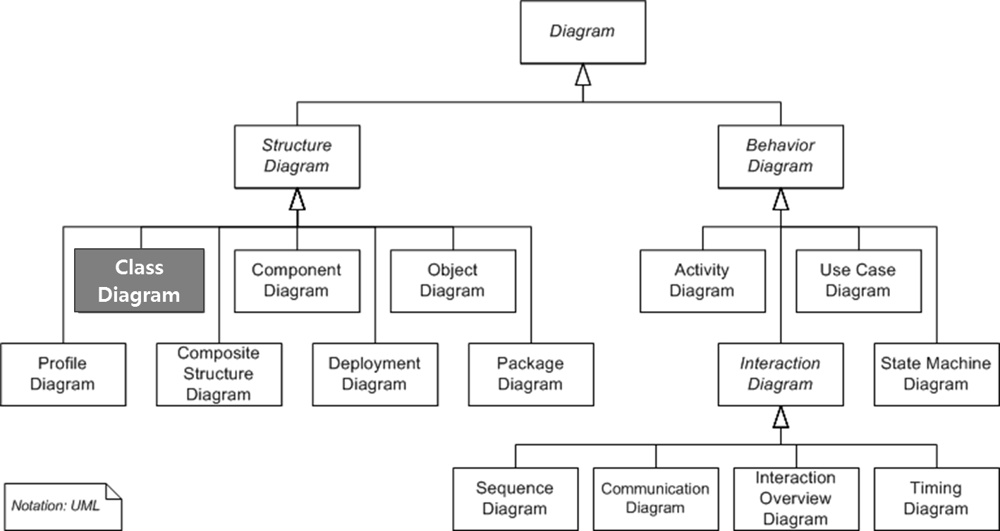

- Structure Diagram : 정적이고, 구조 표현을 위한 다이어그램
- Behavior Diagram : 동적이고, 시퀀셜한 표현을 위한 다이어그램
- 클래스 다이어그램은 Structure Diagram에 속한다.
- 개념/명세/구현 차원으로 다이어그램에 관점이 다르다(다른 다이어그램도 마찬가지)


---
- 개요 : 클래스 내부의 정적인 내용이나 클래스 사이의 관계를 표현

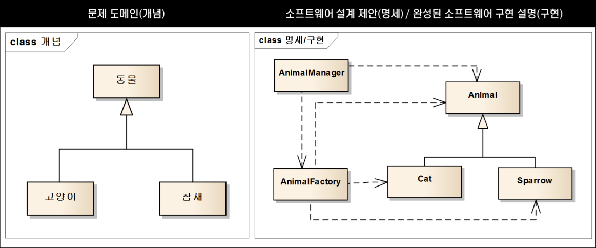

- 개념 차원 다이어그램은 소스코드와 그렇게 관계가 깊지 않다.
- 개념 차원 다이어그램은 사람이 풀고자 하는 problem domain 안에 있는 추상적인 개념을 기술한다. (자연어에 가깝다.)
- 위 사진에, 개념 차원 다이어그램은 동물은 고양이다 / 동물은 참새다를 일반화 관계로 표현한거다.(이게 전부다.)
- 개념 차원 다이어그램은 소스코드를 정의하지 않으며, 해서도 안된다.(말그대로 개념)


---
- 명세 차원 다이어그램은 소스코드로 변환 시키려고 작성하는 것.
- 구현 차원 다이어그램은 이미 작성된 소스코드를 설명하려고 작성하는 것.
- 명세/구현 차원 다이어그램이 훨씬 더 의미가 명확하다.
```
 public class Aninal {}

 public class Cat extends Animal {}

 //명세 모델은 위와 같이, 프로그램의 일부를 실제로 기술한다.
```

---
- 클래스란 동일한 속성과 행위를 수행하는 객체의 집합.
- 객체를 생성하는 설계도.
```
public class person {
  //속성
  int age; //나이
  int name; //이름
  int gender; //성별

  //행위
  public eat() {} //먹다
  public sleep() {} //자다
  public run() {} //뛰다
}
```

- 클래스 다이어그램 표현 예시 및 작성법
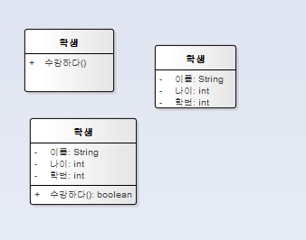
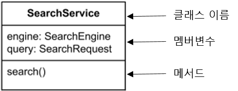

- Class 표기 시, 3가지 부분으로 나뉘어진다.

```
- 클래스 이름은 다음과 같이 네모 박스 안에 기입한다. 다음의 규칙을 따라야 한다.
1. 상자의 가운데에 위치해야 한다.
2. 굵은 글씨체로 기입해야 한다.
3. 첫번째 글자는 대문자로 기입해야 한다.

- 맴버 변수(Attribute)
클래스의 멤버변수는 UML에서 Property라고 하는 개념의 한 종류이다.
각 멤버변수 하나 하나가 property 하나 하나이다.
property는 다음과 같은 순서로 작성한다.

[visiblity] property-name : property-type

- 메서드(Operations)
클래스의 메서드는 UML에서 Operation이라고 하는 개념의 한 종류이다.
각 메서드 하나 하나가 operation 하나 하나이다.
operation은 다음과 같은 순서로 작성한다.

[visiblity] operation-name (property1, property2, ...) : return-type
```

- visiblity : 속성 / 연산 가시화(접근제어자로 이해하면 된다. 속성과 연산을 외부적으로 어느정도 공개 하느냐에 대한 표현이다.)

```
+  : public
-  : private
#  : protected
~  : package
```

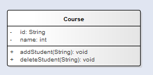

- 다음 클래스를 코드로 변환해 보자.(필드 자료형 잘못했지만.. 그냥 코드로 해봅시다.)

```
public class Course {

  private String id;
  private int name;

  public void addStudent(String id){
    //code
  }

  public void deleteStudent(String id){
    //code
  }
}


```

---

- 관계(Relationship)
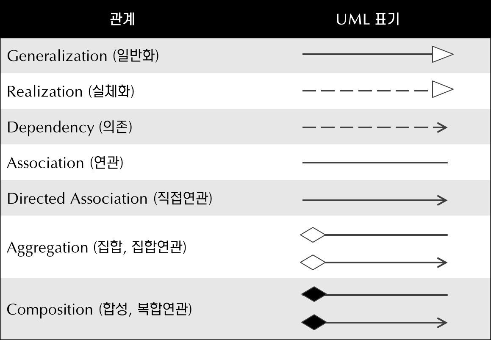
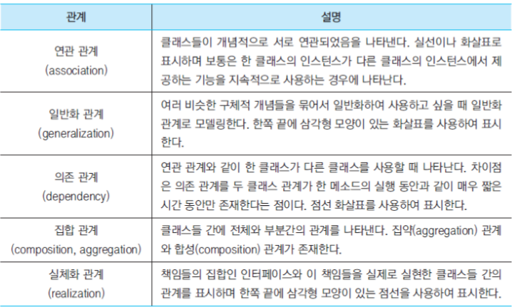

- 클래스 하나로만 시스템은 존재하지 않는다. 클래스들의 사이의 관계를 맺어 기능을 수행하는데, UML에서 제공하는 클래스들 사이의 관계를 정리.

 1. 일반화 관계(상속 관계) : is (a / an)
 
 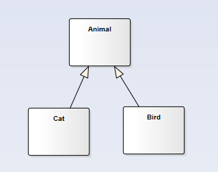
 
 -Cat is an animal. / Bird is an animal.<br>
 -상속관계의 클래스를 연결하고, super class(부모)에 빈삼각형을 그린다.<br>

 2. 의존 관계
 
 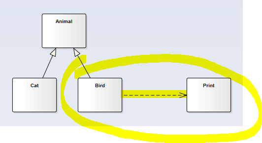
 
 -의존관계는 한 클래스가, 다른 클래스를 맴버변수로 가지고 있지 않고 지역변수 / 파라미터 등 일시적으로 사용되는 관계이다.(Bird 클래스에서 뭔가 출력하려면 Print 클래스의 인스턴스를 생성해서 작업을 해야하니. 그래서 의존적이다라고 하는거다.)<br>
 -의존관계의 클래스를 점선으로 연결하고, 참조 당하는 쪽을 > 를 그린다.<br>

 3. 실체화 관계
 
 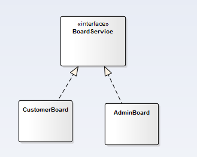
 
 -interface는 'can do this' 관계다.(그래서, 보통 인터페이스 이름이 ~able로 끝난다.)<br>
 -<<>> 스테레오 타입은 원하는 이름을 쓰는데, 이름은 keyword라고 한다.<br>
 -인터페이스와 구현클래스를 점선으로 연결하고, 인터페이스에 빈 삼각형을 그린다.<br>

 4. 연관 관계(Association)
 
 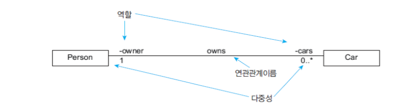
 
 -클래스들이 서로 연관되어있음을 나타냄.<br>
 -한 클래스가 다른 클래스를 맴버변수로 가지는 경우.<br>
 -관계가 있는 클래스를 실선으로 연결하고, 사용당하는 쪽을 > 그린다.<br>
 -양방향으로 관계가 있을 시, 화살표는 생략해도 된다.<br>
 
 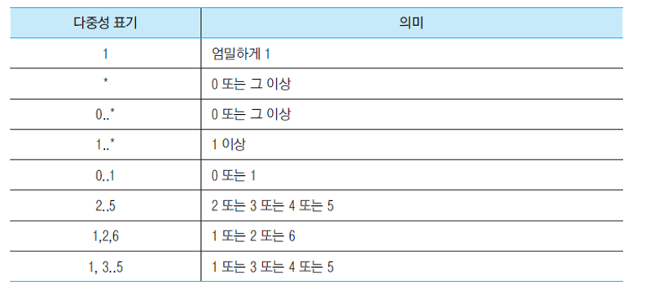
 
 -사람은 자동차를 소유할수도 있고, 없을수도 있다. 이런 관계는 다중성을 이용해서 표현한다.<br>
 -다중성을 표지하지 않은것은 1을 의미.<br>

 ```
 public Class Person{
   private Car[] cars;
 }

 public Class Car{
   private Person owner;
 }

 ```

 5. 집합 관계(Aggregation:집약 / Composition:합성)
 -집합관계는 전체 / 부분과의 관계를 명확하게 나타내고자 사용.<br>
 -집합관계는 has (a/an) 관계를 나타낸다.(사람 has a 자동차 / 학교 has a 학생 / 은행 has a 고객정보)<br>
 -관계가 있는 클래스를 실선으로 연결하고, 전체쪽에 마름모 / 부분쪽에 > 그린다.<br>
 
 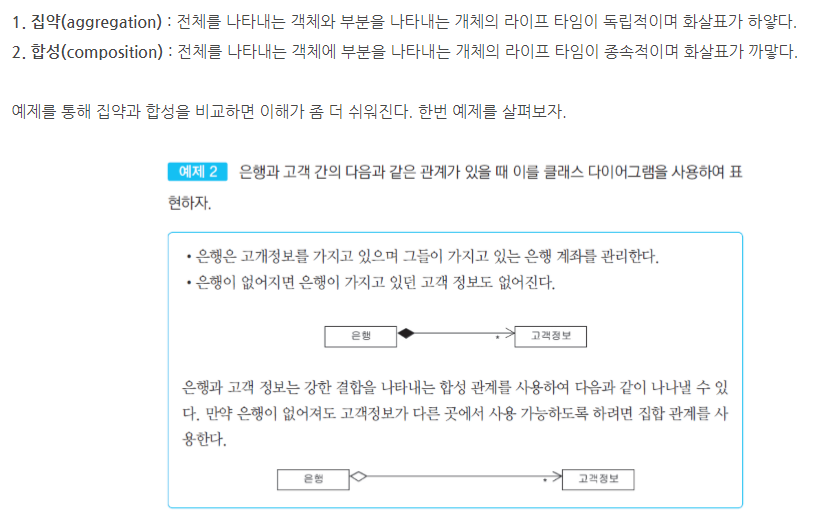

 ```
 -집합 집약관계는 라이플사이클이 독립적.(빈 마름모)
 (new로 객체를 직접 생성하지 않음: 전체가 부분클래스를 직접 생성하지 않음)

 -집합 합성관계는 라이플사이클이 종속적이다.(찐한 마름모)
 (new로 객체를 직접 생성: 생성자 또는 메서드 내에서.)
 ```
